<div align="center">

# ⚽ KickSplit

### Smart team balancing for amateur football groups

A full-stack platform for organizing recurring football games, generating balanced teams, tracking results, and learning player ratings over time.

</div>

<p align="center">
  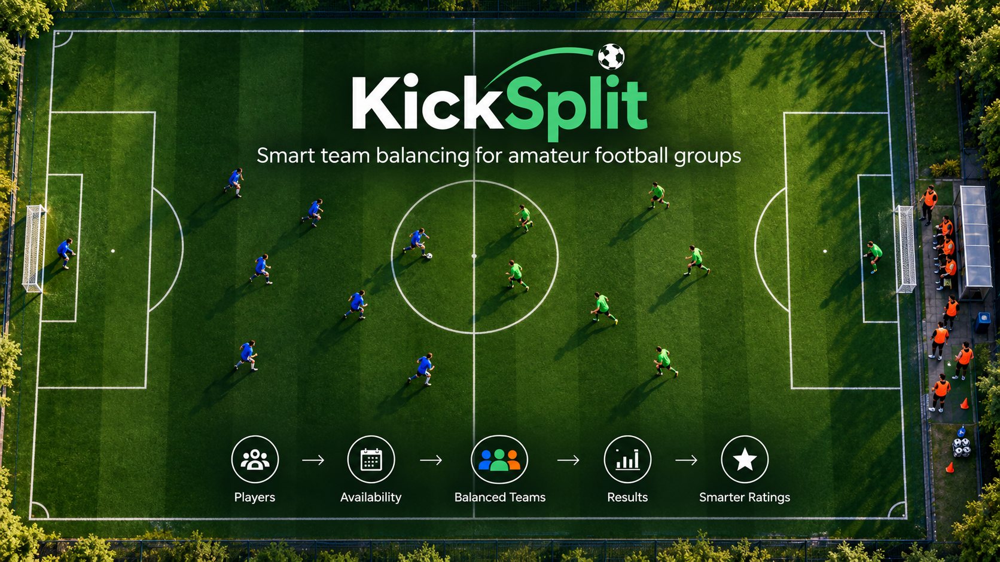
</p>

---

## Table of Contents

1. [Introduction](#1-introduction)
2. [KickSplit System](#2-kicksplit-system)
3. [Architecture & Implementation](#3-architecture--implementation)
4. [Algorithmic Design](#4-algorithmic-design)
5. [Evaluation](#5-evaluation)
6. [Evaluation Metrics](#6-evaluation-metrics)
7. [Results](#7-results)
8. [Discussion](#8-discussion)
9. [Limitations & Future Work](#9-limitations--future-work)
10. [Conclusions](#10-conclusions)

---

# 1. Introduction

## The Problem

Organizing recurring amateur football games involves much more than simply deciding when and where to play. Players need to indicate their availability, the participating squad changes from game to game, teams must be created, results need to be recorded, and the perceived level of each player may change over time.

These tasks are often handled using separate tools and informal processes. This can make the organization of a recurring group unnecessarily fragmented. Team formation is especially challenging: even when the list of participating players is known, creating teams that are reasonably balanced is not trivial, particularly when player levels vary and attendance changes every week.

## Motivation

The motivation for KickSplit came directly from the way games were organized in my own football group. Player registration was handled through **WhatsApp**, while team division was performed separately using **ChatGPT**. To generate teams, player information had to be transferred manually into another tool, and the resulting teams were then brought back to the group.

At the same time, there was no single place that maintained player ratings, availability, previous team assignments, game results, and player statistics. Each part of the process existed separately. The problem was therefore not only how to create balanced teams, but also how to connect the entire workflow into one consistent system.

Other amateur football groups may organize their games differently, but the same general problem can appear whenever game management depends on messaging applications, manual decisions, and information that is scattered across several places.

## Goal

KickSplit was developed as a web-based platform that brings this process into one system. The application supports group management, game creation, player availability, guest players, balanced team proposals, voting between proposals, recorded results, game history, player statistics, and ratings.

A central part of the project is the team-generation algorithm. KickSplit uses player ratings to generate several balanced three-team proposals rather than producing only a single split. In addition, the system maintains a dynamic **App Rating** that begins from the player's initial self-rating and can change over time according to recorded game results.

The project therefore has two connected goals: to build a practical system for managing recurring amateur football games, and to evaluate the algorithmic mechanisms used for team balancing and player ratings.

The experimental part of the project focuses on three main questions:

- Does KickSplit generate more balanced teams than random splitting?
- Can the App Rating improve its estimate of player skill over repeated games?
- How does App Rating compare with ratings provided by other players?

---

# 2. KickSplit System

KickSplit is designed as a complete workflow for recurring amateur football groups. Rather than treating team balancing as an isolated task, the system manages the process from group creation and game planning through team generation, voting, result recording, and player statistics.

## 2.1 Users and Groups

Users create an account and can either create a football group or join an existing one through an invitation link. A user may belong to multiple groups.

Player ratings are maintained per group rather than globally, since the relative level of a player may differ between different groups. Each member initially provides a self-rating, which serves as the starting point for later team generation and rating updates.

<p align="center">
  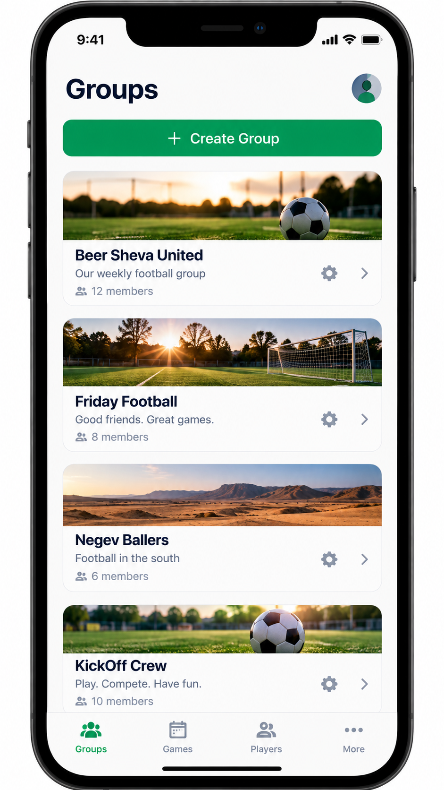
</p>
<p align="center"><em>Group management in KickSplit.</em></p>

## 2.2 Game Planning and Availability

A group can create proposed game days, and members independently indicate whether they are available for each game. Players who are marked as available are considered when teams are generated.

The system also supports guest players who do not have an account. Guests are associated only with a specific game and are assigned a temporary rating by the user who adds them.

<p align="center">
  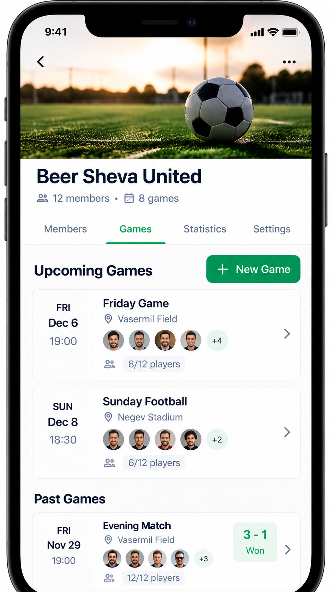
</p>
<p align="center"><em>Upcoming and completed games inside a football group.</em></p>

## 2.3 Team Proposals and Voting

Once the set of participants is known, KickSplit generates up to three balanced team proposals. Each proposal divides the participants into three teams with sizes as equal as possible.

The proposals are then presented to the participating players, who can vote for the option they prefer. This combines automatic team generation with a social decision process, rather than forcing a single automatically generated split.

If participants are not satisfied with the available proposals, they can request a new set of teams. Once the required number of requests is reached, the previous proposals and votes are cleared and a new set of proposals is generated.

<p align="center">
  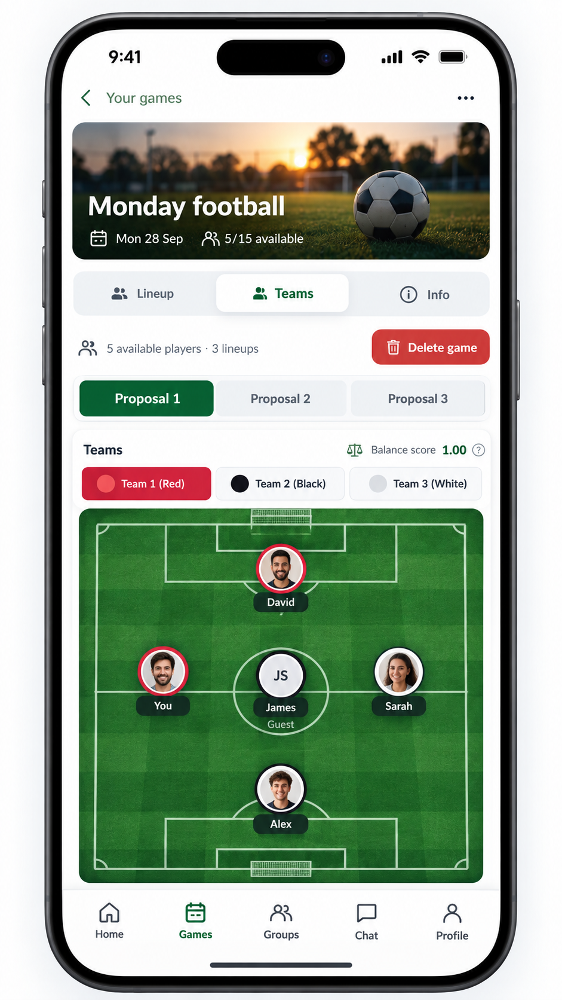
</p>
<p align="center"><em>Generated team proposals and balance information.</em></p>

## 2.4 Results and Game History

After a game is played, the system stores the selected team proposal together with the number of wins achieved by each of the three teams.

Completed games are stored in the group history, allowing past team compositions and results to remain available instead of being lost in chat messages or informal records.

<p align="center">
  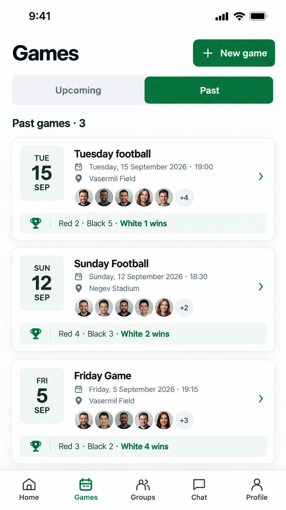
</p>
<p align="center"><em>Past games and recorded results.</em></p>

## 2.5 Ratings and Player Statistics

Game results are also used to maintain player statistics and a dynamic **App Rating**. The App Rating starts from the player's initial self-rating and is updated as additional game results are recorded.

The system stores statistics such as the number of games played, wins, and win rate. Groups can also choose whether future team generation should use the original **Self Rating** or the dynamic **App Rating**.

<p align="center">
  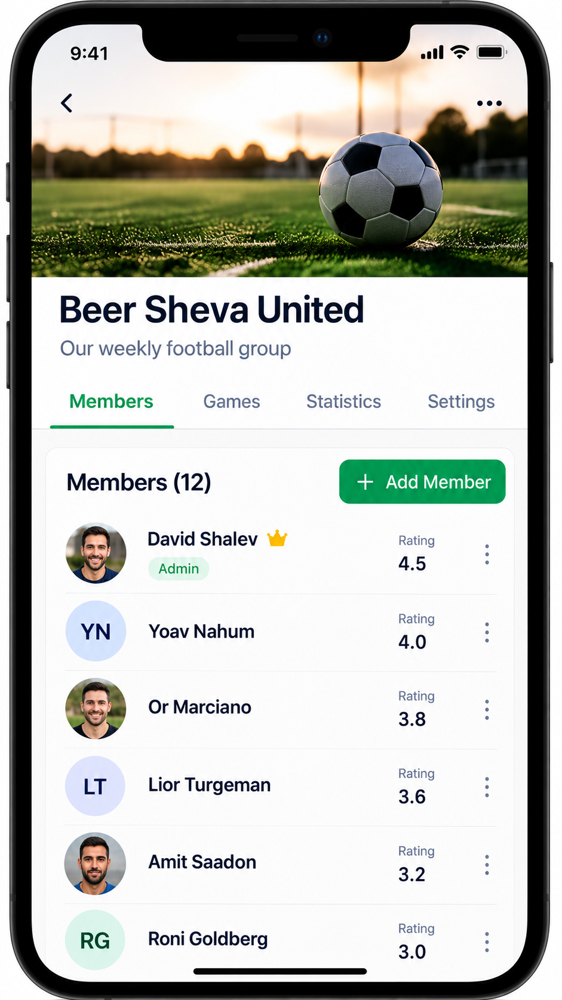
</p>
<p align="center"><em>Group members and player ratings.</em></p>

---

# 3. Architecture & Implementation

KickSplit was implemented as a client-server web application with a clear separation between the user interface, backend logic, and persistent data storage.

<p align="center">
  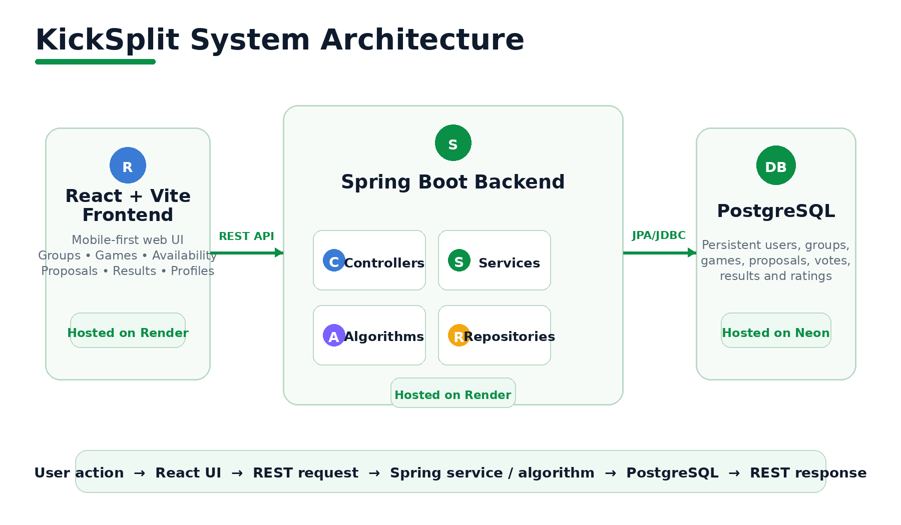
</p>
<p align="center"><em>KickSplit system architecture and deployment.</em></p>

The overall architecture consists of a React frontend communicating through a REST API with a Spring Boot backend, which manages the application logic and stores persistent data in PostgreSQL.

## 3.1 Frontend

The client side of KickSplit was developed using **React** and **Vite**, with **React Router** used for navigation between the different application views.

The frontend handles the user-facing parts of the system, including authentication, groups, games, availability, team proposals, voting, results, player statistics, and profile management. Persistent information is retrieved from and sent to the backend through REST API requests.

KickSplit was also configured as a **Progressive Web App (PWA)**, providing an application-like experience on mobile devices while remaining a web application.

## 3.2 Backend

The server side was implemented in **Java 21** using **Spring Boot**.

The backend contains the main business logic of the system and follows a layered structure:

```text
Controller
    ↓
Service
    ↓
Repository
    ↓
Database
```

Controllers expose the REST endpoints used by the frontend. Services implement the application logic, including game management, availability, voting, result handling, team proposal generation, and rating recalculation. Repositories provide database access through **Spring Data JPA**.

The algorithmic components of KickSplit are also executed on the backend, separating team generation and rating logic from the user interface.

## 3.3 Database and Data Model

Persistent data is stored in a **PostgreSQL** database using JPA entities.

The main data model represents:

- users and football groups;
- group memberships and group-specific player ratings;
- games and player availability;
- guest players;
- generated team proposals;
- votes;
- game results;
- requests for new team proposals.

<p align="center">
  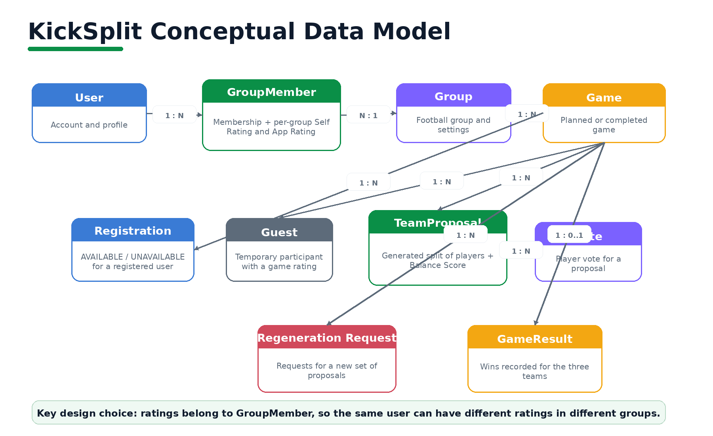
</p>
<p align="center"><em>Conceptual data model showing the main persisted entities and relationships.</em></p>

An important design decision is that player ratings belong to the relationship between a **User** and a **Group**, rather than directly to the user. This allows the same player to have a different rating in different football groups.

Generated team proposals are also stored in the database. Therefore, all users viewing the same game see the same proposals and the same current voting state.

## 3.4 Component Interaction

When the frontend requests team proposals, the backend retrieves the relevant players and ratings, runs the team-generation algorithm, stores the generated proposals, and returns them to the frontend.

```text
React UI
   ↓
REST API
   ↓
Spring Boot Service
   ↓
Team Generation Algorithm
   ↓
PostgreSQL
   ↓
React UI
```

The same architecture is used when game results are recorded: the result is stored in the database and the backend updates the relevant player ratings, which can then affect future team generation.

## 3.5 Deployment

KickSplit was first developed locally and was later deployed as a working web application.

The production **React frontend** and **Spring Boot backend** are deployed separately on **Render**, while the production **PostgreSQL database** is hosted on **Neon**.

Environment variables are used for production-specific configuration, allowing the same codebase to work with both the local development environment and the deployed production environment.

---

# 4. Algorithmic Design

The algorithmic side of KickSplit has two main responsibilities: **creating balanced teams for the current game** and **improving the player ratings used in future games**.

The full process starts with the players who are available for a game, uses their ratings to generate several team proposals, evaluates how balanced those proposals are, and later uses the recorded results to update the App Rating.

## 4.1 Choosing the Player Rating

Before generating teams, KickSplit collects all registered players marked as `AVAILABLE`, together with any guest players added to the game.

Each participant is represented by a numerical rating. For registered players, the group can choose which rating source should be used:

- **Self Rating** — the rating initially provided by the player.
- **App Rating** — a dynamic rating learned from previous game results.

Guest players receive a temporary rating when they are added to the game.

This separation is useful because the team-generation algorithm itself does not depend on where the rating came from. It simply receives a list of players and their current ratings.

## 4.2 Building One Team Split

KickSplit always divides the participating players into **three teams**.

The algorithm first calculates the required size of each team. If the number of players is not divisible by three, the extra players are distributed so that the difference between team sizes is never greater than one.

The players are then sorted from **highest rating to lowest rating**.

Processing the strongest players first is intentional: high-rated players have the greatest effect on the strength of a team, so placing them early makes it easier to compensate with the remaining players.

For each player, the algorithm looks at the teams that still have room and assigns the player to the team with the **lowest current total rating**.

```text
Sort players from strongest to weakest

For each player:
    find teams that still have room
    find the team with the lowest rating sum
    assign the player to that team
```

If several eligible teams have the same minimum rating sum, one of them is selected randomly.

This is a greedy strategy: every decision is based on the current state of the teams, without trying every possible future combination.

## 4.3 From One Split to Several Proposals

A single greedy run is not always enough.

Because ties can be resolved differently, the same group of players can produce more than one valid split. KickSplit therefore repeats the greedy splitting procedure **100 times**.

After the runs are complete, duplicate proposals are removed, each remaining proposal receives a Balance Score, the proposals are ranked, and KickSplit returns up to the **three best generated proposals**.

<p align="center">
  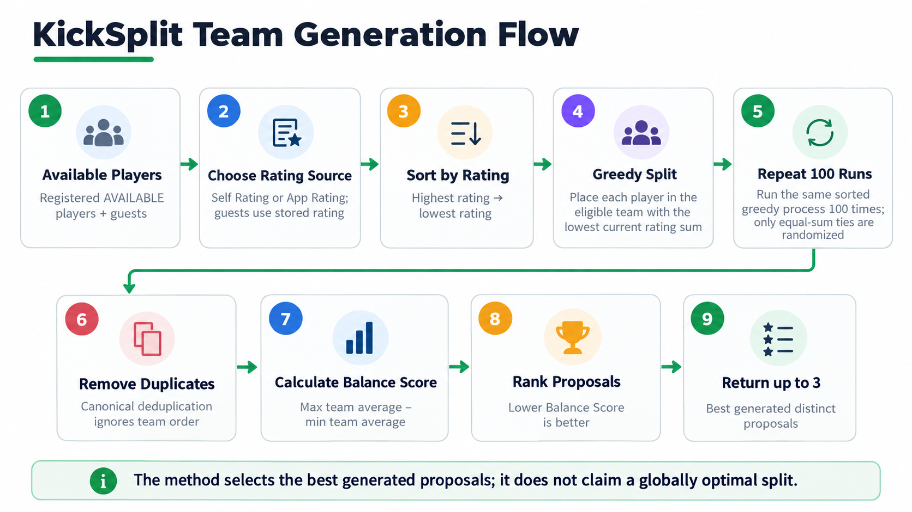
</p>
<p align="center"><em>Team-generation flow from available players to the three best generated proposals.</em></p>

Two proposals are treated as identical if they contain the same three teams, even when the teams appear in a different order.

The algorithm does **not** claim to find the globally optimal division. Instead, it generates a collection of greedy solutions and keeps the strongest ones it found.

## 4.4 Measuring Team Balance

To compare two team proposals, KickSplit needs a simple numerical measure of balance.

For each team $T_i$, the average player rating is:

$$
Avg(T_i)=
\frac{\sum_{p \in T_i} Rating(p)}
{|T_i|}
$$

The **Balance Score** is then defined as the difference between the strongest and weakest team averages:

Balance Score = max team average - min team average

For example:

```text
Team 1 average: 3.20
Team 2 average: 3.15
Team 3 average: 3.30

Balance Score = 3.30 - 3.15 = 0.15
```

A score close to **0** means that the three teams have very similar average ratings. Therefore, **lower is better**.

## 4.5 Learning From Game Results — App Rating

Team balancing is only as useful as the ratings given to the algorithm.

For this reason, KickSplit also maintains a dynamic **App Rating**. It starts from the player's initial rating and changes over time according to recorded game results.

For each completed game, the system calculates the strength of every team using the average App Rating of its players.

If the team strengths are $S_1$, $S_2$, and $S_3$, the expected share of team $i$ is:

$$
Expected_i =
\frac{S_i}
{S_1+S_2+S_3}
$$

The actual share is based on the number of wins recorded for the three teams:

$$
Actual_i =
\frac{Wins_i}
{Wins_1+Wins_2+Wins_3}
$$

The rating update is:

Rating_new = Rating_old + K × (Actual - Expected)

The value of $K$ decreases as a player accumulates more games:

$$
K =
\max
\left(
0.10,\;
\frac{0.8}
{\sqrt{games+1}}
\right)
$$

This means that early games can cause larger changes, while ratings become more stable as more history is collected. The minimum value of **0.10** ensures that the rating never stops adapting completely.

App Ratings are always restricted to:

$$
1.0 \leq AppRating \leq 5.0
$$

Because KickSplit currently records **team results rather than individual performance**, every registered player on the same team receives the same rating change for that game.

If no wins are recorded for any team, the system treats the actual share as equal to the expected share, producing no rating change.

<p align="center">
  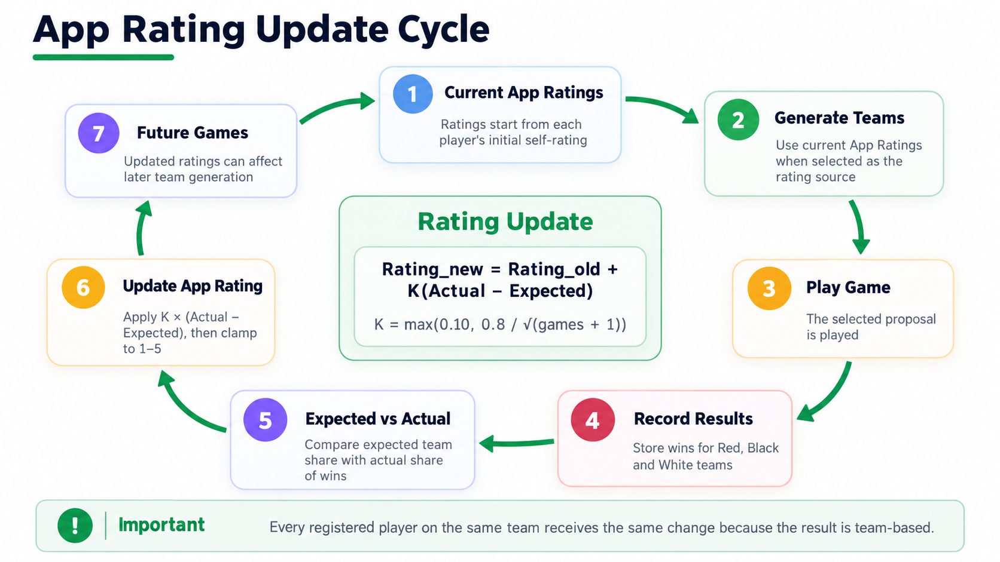
</p>
<p align="center"><em>How recorded game results influence future App Ratings and team generation.</em></p>

---

# 5. Evaluation

The algorithmic components of KickSplit were evaluated using controlled simulations. The goal was not to reproduce every aspect of real amateur football, but to create repeatable environments in which the team-generation and rating mechanisms could be examined under known conditions.

Three experiments were performed.

## 5.1 Experiment 1 — KickSplit vs. Random Splitting

The first experiment evaluates whether the team-generation algorithm produces more balanced teams than random division.

Synthetic football groups were generated with **20 players per group**, with player ratings in the range of 1 to 5.

Three group types were examined:

- **Balanced** — relatively small variation between player levels.
- **Mixed** — moderate variation.
- **High Variance** — larger differences between stronger and weaker players.

Player attendance varied between game nights.

For every evaluated lineup, KickSplit generated its proposals using the same repeated randomized greedy procedure used by the application.

The baseline consisted of **1,000 random team splits for each lineup**, whose Balance Scores were averaged.

```text
60 simulated groups
20 players per group
20 game nights per group
1,000 random splits per lineup
Random seed: 42
Total evaluated lineups: 1,200
```

The comparison was:

```text
Best generated KickSplit proposal
                 vs.
Average Balance Score of random splitting
```

## 5.2 Experiment 2 — App Rating Learning Dynamics

The second experiment examines whether the App Rating can learn from repeated game results.

Each simulated player was assigned a hidden **True Skill** value. The rating algorithm never receives this value directly.

A player's initial Self Rating was generated as a noisy estimate of True Skill. Game outcomes were influenced by team True Skill, while future team generation and expected-result calculations used the current App Ratings.

```text
True Skill
     ↓
Noisy Self Rating
     ↓
Initial App Rating
     ↓
Team Generation
     ↓
Simulated Game Results
     ↓
App Rating Update
     ↓
Future Team Generation
```

To study result noise, the experiment was repeated with:

```text
5 rounds per game
10 rounds per game
20 rounds per game
50 rounds per game
```

Different update-rate strategies were also evaluated, including several minimum values for \(K\):

```text
0.05
0.10
0.15
0.20
```

The final robustness comparison used several independent seed sets and deterministic seeded versions of the randomized splitting procedure to ensure reproducible parameter comparisons.

In addition to the population-level MAE, two individual players were tracked to illustrate how the App Rating behaves over time in specific cases.

The first was a strong player whose initial rating underestimated the player's True Skill. The second was a weaker player whose initial rating overestimated the player's True Skill.

Tracking both cases makes it possible to observe whether the rating system can correct estimation errors in both directions, rather than looking only at the average error across the full simulated population.

```text
Strong player:
True Skill = 4.8
Initial Rating = 4.0

Weak player:
True Skill = 2.0
Initial Rating = 2.6
```

## 5.3 Experiment 3 — App Rating vs. Peer Rating

The third experiment compares App Rating with ratings produced by simulated peer evaluators.

Peer ratings were generated by adding controlled noise to a player's hidden True Skill.

Three numbers of peer evaluators were tested:

```text
1 peer
3 peers
5 peers
```

Three peer-noise levels were tested:

```text
Standard deviation = 0.4
Standard deviation = 0.8
Standard deviation = 1.2
```

When several peers rated the same player, their ratings were averaged.

The App Rating was evaluated with **5, 10, 20, and 50 rounds per game**, with measurements taken after:

```text
0, 5, 10, 20, 50, 100, and 300 rated games
```

The experiment used **five independent seed sets**, with **20 groups of 20 players** in each seed set.

The Peer Rating model is intentionally idealized: peer errors are independent and centered around True Skill, without shared social bias, reputation effects, anchoring, or systematic disagreement.

## 5.4 Interpretation of the Simulations

The simulations provide a controlled environment in which hidden skill, initial rating error, result noise, and repeated games can be varied independently.

They should not be interpreted as proof that real football groups behave exactly like the simulated population.

The purpose of the experiments is to evaluate the internal behavior of the algorithms under reasonable and reproducible assumptions rather than to create conditions in which KickSplit is guaranteed to outperform alternative methods.

---

# 6. Evaluation Metrics

Three main metrics were used.

## 6.1 Balance Score

The Balance Score measures the difference between the highest and lowest team average ratings.

Balance Score = max team average - min team average

Lower values indicate more balanced teams.

## 6.2 Improvement over Random Splitting

The improvement over the random baseline is calculated as:

Improvement (%) = ((Random Score - KickSplit Score) / Random Score) × 100

A larger positive value indicates greater improvement over the random baseline.

## 6.3 Mean Absolute Error

Experiments 2 and 3 use **Mean Absolute Error (MAE)** to measure rating accuracy.

MAE = (1 / N) × Σ |Estimated Rating - True Skill|

Lower MAE indicates that the estimated ratings are closer to the hidden True Skill values.

Because MAE is measured on the same 1–5 rating scale, it also has a direct interpretation. For example, an MAE of **0.40** means that the estimated rating differs from True Skill by about **0.40 rating points on average**.

---

# 7. Results

## 7.1 Experiment 1 — KickSplit vs. Random Splitting

Across all **1,200 simulated lineups**, the best generated KickSplit proposal achieved a lower Balance Score than the random-splitting baseline.

| Method | Mean Balance Score |
|---|---:|
| KickSplit | 0.173 |
| Random Splitting | 0.586 |

The average relative improvement was approximately **70.2%**, with a median improvement of approximately **67.5%**.

| Group Type | KickSplit | Random | Mean Improvement |
|---|---:|---:|---:|
| Balanced | 0.081 | 0.259 | 68.8% |
| Mixed | 0.177 | 0.614 | 70.9% |
| High Variance | 0.260 | 0.885 | 70.8% |

<p align="center">
  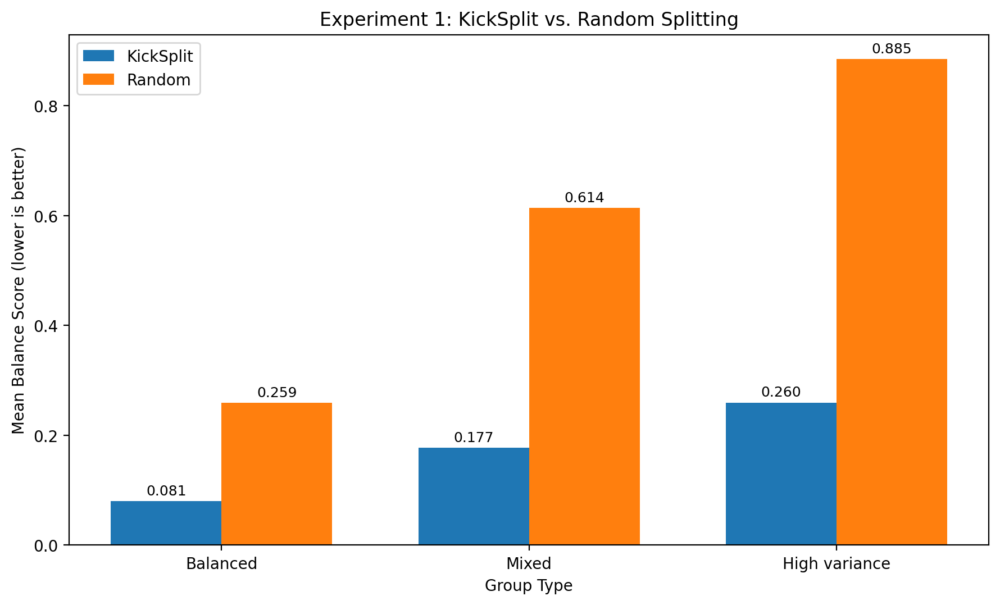
</p>

<p align="center"><em>Figure 1: Mean Balance Score of the best generated KickSplit proposal compared with the random-splitting baseline.</em></p>

The absolute Balance Score increased as player-rating variation increased, while the relative improvement over random splitting remained close to 70% across all three group types.

## 7.2 Experiment 2 — App Rating Learning Dynamics

### Initial Behavior

The first version of the experiment used five simulated rounds per game and examined whether repeated game results caused the App Rating to move closer to the players' hidden True Skill values.

At the population level, the App Rating error did not improve:

| Rated Games | App Rating MAE |
|---:|---:|
| 0 | 0.454 |
| 5 | 0.479 |
| 10 | 0.487 |
| 20 | 0.487 |
| 40 | 0.485 |

Instead of decreasing, the average error increased slightly. This showed that repeatedly updating the rating does not automatically make it more accurate when game results contain substantial noise.

The two individual players introduced in Section 5.2 illustrate how the same rating mechanism can behave differently for different players.

The strong player started with a rating of **4.0**, below a True Skill of **4.8**, and moved toward the correct value, reaching approximately **4.772** after 69 rated games.

The weak player started with a rating of **2.6**, above a True Skill of **2.0**, but moved in the wrong direction and ended at approximately **2.964** after 71 rated games.

<p align="center">
  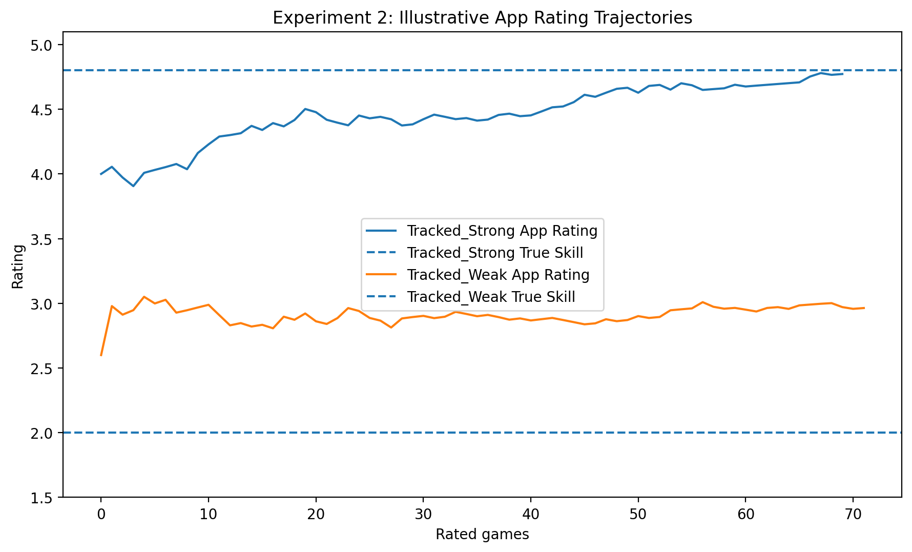
</p>

<p align="center"><em>Figure 2: Example App Rating trajectories for a simulated strong player and weak player.</em></p>

These results motivated a second question: was the poor population-level behavior caused partly by noisy game results?

### Effect of Result Noise

To test this, the amount of information contained in each simulated game was varied by changing the number of rounds used to produce the game result.

More rounds reduce the influence of short-term randomness and make the final result more representative of the underlying team strengths.

At 40 rated games:

| Rounds per Game | MAE |
|---:|---:|
| 5 | 0.477 |
| 10 | 0.439 |
| 20 | 0.431 |
| 50 | 0.421 |

<p align="center">
  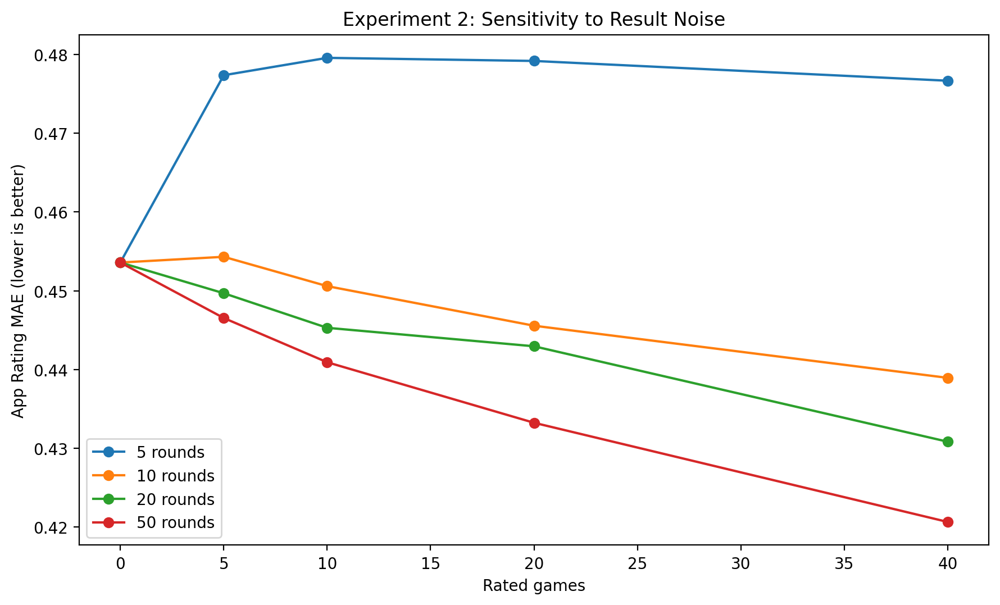
</p>

<p align="center"><em>Figure 3: App Rating MAE over repeated games for different numbers of simulated rounds per game.</em></p>

The error decreased as the number of rounds increased. This indicates that the App Rating learns more accurately when game results contain more reliable information about the relative strength of the teams.

This led to the final part of the experiment: examining whether the rating update rate itself could be improved.

### K-Factor Robustness

The original update rule gradually reduced the K-factor as more games were played. This makes ratings increasingly stable, but after many games it can also make corrections very small.

A modified rule was therefore tested in which K is never allowed to fall below **0.10**.

After 300 rated games:

| Rounds per Game | Original K | K with 0.10 Floor |
|---:|---:|---:|
| 5 | 0.453 | 0.449 |
| 10 | 0.412 | 0.395 |
| 20 | 0.391 | 0.374 |
| 50 | 0.383 | 0.356 |

<p align="center">
  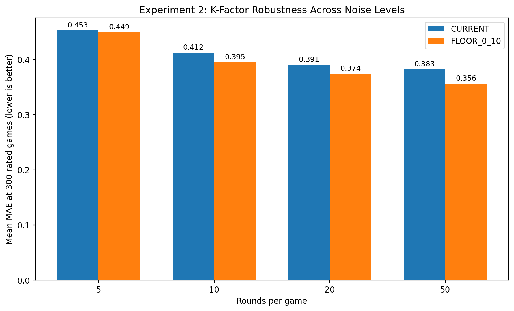
</p>

<p align="center"><em>Figure 4: Mean App Rating error using the original decreasing-K strategy and the selected K = 0.10 floor.</em></p>

The 0.10 floor produced only a small improvement in the noisiest condition, but produced clearer improvements as game results became more informative.

For this reason, the final production implementation uses:

K = max(0.10, 0.8 / sqrt(games + 1))

This keeps the rating responsive to new information even after a player has accumulated a long game history.

## 7.3 Experiment 3 — App Rating vs. Peer Rating

At **300 rated games**, the App Rating MAE was:

| Rounds per Game | App Rating MAE |
|---:|---:|
| 5 | 0.449 |
| 10 | 0.395 |
| 20 | 0.374 |
| 50 | 0.356 |

Peer Rating MAE was:

| Number of Peers | Noise = 0.4 | Noise = 0.8 | Noise = 1.2 |
|---:|---:|---:|---:|
| 1 | 0.320 | 0.614 | 0.863 |
| 3 | 0.181 | 0.349 | 0.489 |
| 5 | 0.143 | 0.275 | 0.388 |

<p align="center">
  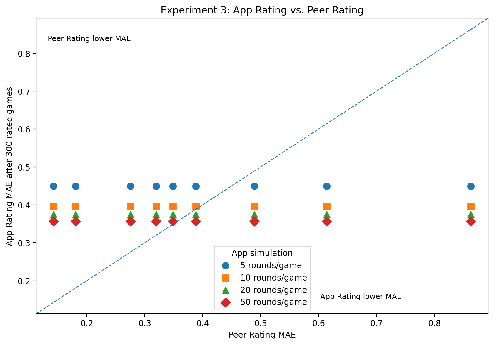
</p>

<p align="center"><em>Figure 5: App Rating MAE compared with Peer Rating MAE after 300 rated games.</em></p>

With low peer noise, averaging several peer ratings produced highly accurate estimates.

When peer information was sparse or sufficiently noisy, App Rating could achieve lower MAE. For example:

- against **one peer with noise 0.8 or 1.2**, App Rating had lower MAE in all four round conditions;
- against **three peers with noise 1.2**, App Rating had lower MAE in all four round conditions;
- against **five peers with noise 1.2**, App Rating had lower MAE in the 20- and 50-round conditions.

---

# 8. Discussion

## 8.1 Team Balancing Performance

Experiment 1 showed a clear advantage of the KickSplit team-generation process over random splitting.

Players are processed from strongest to weakest and assigned to the weakest eligible team. KickSplit also evaluates 100 randomized greedy attempts rather than relying on only one execution.

This produced a similar relative improvement across balanced, mixed, and high-variance populations.

The results demonstrate effectiveness relative to the tested random baseline, but do not imply that the generated split is globally optimal.

## 8.2 What the Initial App Rating Failure Revealed

The first App Rating experiment produced an important unexpected result: with only five rounds per simulated game, rating accuracy became worse rather than better.

One important reason is that KickSplit receives **team-level feedback rather than individual-level feedback**. Every registered player on a team receives the same rating adjustment even though their individual contributions may differ.

The tracked weak-player case demonstrates this limitation particularly clearly.

Rather than modifying the simulation to force a successful outcome, this result motivated the later noise and K-factor experiments.

## 8.3 Result Noise and Learning Rate

A short game contains substantial randomness. A weaker team may win more often than expected over only a small number of rounds, causing the rating system to interpret noise as evidence about player ability.

Increasing the number of rounds made results more informative and improved rating learning.

This creates a trade-off in \(K\):

- larger \(K\) values correct wrong ratings faster when information is reliable;
- larger \(K\) values also amplify noisy results;
- smaller \(K\) values are more stable;
- excessively small \(K\) values can make long-term correction too slow.

The selected **0.10 minimum K** was therefore chosen as a compromise across different simulated conditions rather than because it was always the best value in every scenario.

## 8.4 App Rating vs. Peer Rating

Neither App Rating nor Peer Rating was universally more accurate.

Several independent, low-noise peer ratings produced a strong estimate of player ability because averaging reduced individual errors.

App Rating became more competitive when peer information was sparse or noisy and when game results contained sufficient information.

The two approaches therefore use different information sources:

```text
Peer Rating
→ direct human evaluations
→ benefits from several reliable evaluators

App Rating
→ repeated observed team results
→ benefits from informative game outcomes
```

The simulated Peer Rating model is favorable to peer evaluation because peer errors are independent and centered around True Skill. Real human ratings may also contain shared bias, reputation effects, anchoring, or limited knowledge.

## 8.5 Overall Interpretation

The experiments suggest a useful distinction between KickSplit's two central algorithmic problems.

For **team generation**, once meaningful ratings are available, the multi-proposal greedy method consistently produces better-balanced teams than the tested random baseline.

For **rating estimation**, the problem is more uncertain. Results contain useful information, but they are indirect observations of individual ability.

App Rating should therefore be treated as an evolving estimate based on game history rather than as an exact measurement of player skill.

---

# 9. Limitations & Future Work

## 9.1 Rating Model Limitations

The current App Rating learns only from team-level results. All registered players on the same team receive the same rating adjustment, even though their individual contributions may differ.

Future versions could incorporate individual performance indicators, player positions, peer feedback, or other signals that distinguish between players within the same team.

## 9.2 Richer Player Representation

The current team-generation process is based primarily on a single overall rating.

Future versions could make greater use of attacking ability, defensive ability, preferred position, goalkeeper availability, or other player attributes. This could allow teams to be balanced not only in overall strength but also in internal structure and playing roles.

## 9.3 Real-World Evaluation

The current experimental evaluation is based on controlled simulations.

Future work could evaluate KickSplit using data collected from real groups over longer periods and examine:

- whether lower Balance Scores are associated with closer real match results;
- how App Ratings evolve in practice;
- whether players agree with the generated proposals.

## 9.4 More Advanced Team-Generation Methods

The current method uses repeated randomized greedy splitting and does not guarantee a globally optimal solution.

Future work could compare it with approaches such as:

- local search;
- simulated annealing;
- integer optimization;
- other heuristic or metaheuristic techniques.

Such comparisons could consider both solution quality and computational cost.

## 9.5 Social and Community Expansion

A broader future direction is to expand KickSplit beyond the management of individual football groups.

Players could maintain richer profiles containing playing history, preferences, positions, and ratings across different groups.

Groups looking for additional players could discover suitable players, while individual players could find groups or games that match their location, availability, and playing level.

This could also support a broader cross-group rating model. Today, ratings are group-specific because player level is relative to the group in which the player participates. In a larger network, information from several groups could potentially be combined to estimate a more general rating that remains meaningful when a player joins a new group.

Such a rating would require careful calibration between groups rather than simply transferring one group's rating directly to another.

In this direction, KickSplit could evolve from a tool for organizing and balancing individual football groups into a broader social platform connecting amateur players, games, and groups.

---

# 10. Conclusions

KickSplit was developed as a complete web-based system for organizing recurring amateur football groups. The project combines practical group-management features, including game planning, player availability, guest players, team proposals, voting, results, history, player statistics, and ratings, within a single platform.

The algorithmic evaluation showed that the team-generation approach consistently produced more balanced teams than the tested random-splitting baseline. Across the simulated lineups, repeated randomized greedy splitting followed by proposal ranking provided a practical method for generating strong team divisions without claiming global optimality.

The App Rating experiments revealed a more complex picture. Game results can provide useful information for refining player ratings over time, especially when the results are sufficiently informative. At the same time, team-level feedback and noisy outcomes limit the precision of individual rating updates. The App Rating should therefore be viewed as an evolving estimate of player ability rather than an exact measurement.

Overall, KickSplit demonstrates how a real software system can combine application development with algorithmic design and experimental evaluation. The project provides a practical foundation for managing amateur football groups while also opening several directions for future work, including richer player models, real-world evaluation, more advanced team-generation methods, and broader social connections between players and groups.

---

<div align="center">

**KickSplit — Organize. Balance. Play.**

</div>
